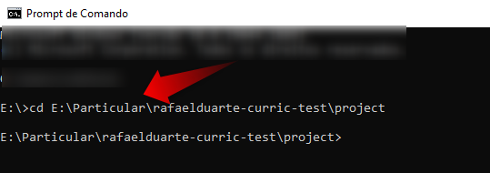
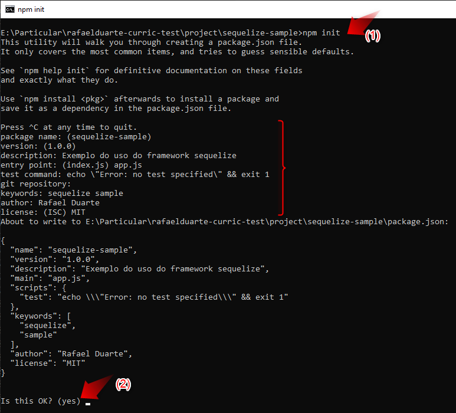
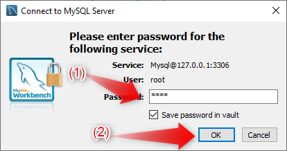
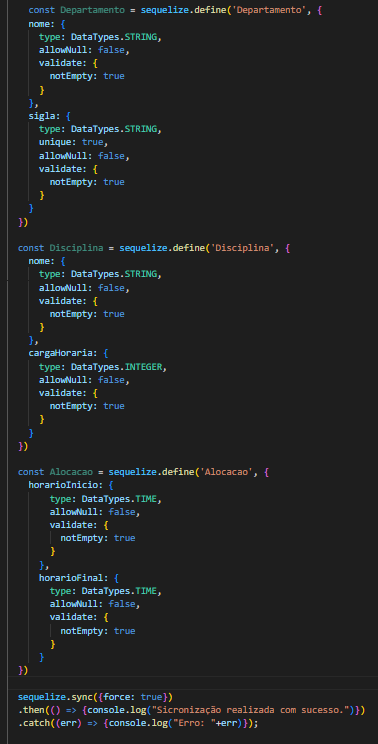

# Sequelize: migrations e relacionamentos entre entidades

## Você será capaz de:
Integrar uma aplicação NodeJs com um banco de dados relacional.

## Por que isso é importante?
Muitas aplicações utilizando o armazenamento em bancos de dados.

## O que vamos aprender?
É bem comum que aplicações precisem armazenar informações. Para isso, existem várias formas de armazenamentos. Em memória, por exemplo em uma lista de objetos, porém se aplicação for desligadas os dados serão perdidos. Em sistemas de arquivos, porém consultar informações podem ser lentas a depender do tamanho do arquivo. Entre tantas outras formas de armazenamento de informações, é frequentemente a utilização de bancos de dados relacionais para o armazenamento de informações de uma aplicação. Sendo assim, o objetivo desse módulo é aprender como uma aplicação NodeJS pode interagir com um banco de dados relacional. 

### Conhecimentos previos
A seguir são listados os principais conhecimentos necessários para o entendimento deste módulo. Caso não esteja familiarizado com algum desses conceitos seria legal dar uma olhadinha antes de prosseguir.
- [Orientação a objetos](https://www.alura.com.br/conteudo/javascritpt-orientacao-objetos?gclid=CjwKCAjwu5yYBhAjEiwAKXk_eEmNz10UeR5rrV30Cwb-feU5xnIF7BECGyTM2fr6ZitGo-LPlIzZzhoCW10QAvD_BwE)
- [Banco de dados relacionais](https://www.oracle.com/br/database/what-is-a-relational-database/)
    - [DDL](https://www.devmedia.com.br/introducao-a-linguagem-sql/40690) 
    - [Tabelas e relacionamento entre tabelas](https://www.juliobattisti.com.br/artigos/office/modelorelacional_p2.asp)
    - [Chave primaria e estrangeira](https://www.devmedia.com.br/sql-aprenda-a-utilizar-a-chave-primaria-e-a-chave-estrangeira/37636)
    - [Modelo Entidade Relacional](https://sites.google.com/site/uniplibancodedados1/aulas/aula-4---modelo-entidade-e-relacionamentos)
- [Gestão de dependencias via npm](https://www.luiztools.com.br/post/como-gerenciar-dependencias-entre-projetos-node-js/).
- [Conceitos básicos de Javascript](https://canaltech.com.br/software/Fundamentos-do-JavaScript-o-que-sao-e-como-funcionam-as-funcoes/).

### Ferramentas
A seguir são listadas as ferramentas que devem ser previamente instaladas. Ao clicar em cada uma será direcionada para tutorias de instalação. Lembrando que este conteúdo foi construído no sistema operacional Windows e caso esteja utilizando outro sistemas operacionais haverá a necessidade de algumas adaptações.
- [Banco de dados Mysql e um cliente para banco de dados Workbench](https://www.youtube.com/watch?v=zpssr3u1EO8)
- [Nodejs](https://balta.io/blog/node-npm-instalacao-configuracao-e-primeiros-passos) 
- [Npm](http://devfuria.com.br/nodejs/instalando-npm/)
- [Visual Studio code](https://code.visualstudio.com/download)

## Problema
Imagine que você foi contratado para construir um sistema para uma instituição de ensino em faculdades que precisa cadastrar todos os seus departamentos, professores e disciplinas. Essas informações precisam estar armazenadas em algum lugar? Sim! E este lugar será um banco de dados. A única exigência da empresa é que o banco dados seja MySql e a aplicação seja implementada em NodeJS.

Existe uma linguagem própria para manipulação da estrutura de um banco de dados no SQL. A DDL (do inglês: *Data Definition Language*) ou Linguagem de Definição de Dados que permite definir e manipular tabelas e outros elementos do esquema de banco de dados. Entretanto, muitos programadores não consideram uma boa prática utilizar código escritos de SQL dentro de sua aplicação.

Um banco de dados armazena informações em tabelas e relacionamento entre as mesmas, por sua vez uma aplicação orientada a objetos armazena informações em objetos. Sendo assim, em uma aplicação que armazene informações em banco de dados a estrutura das tabelas e relacionamento devem representar as classes modelos [^1] e por sua, vez as classes modelos devem representar as tabelas do banco de dados.

Em uma aplicação comercial é comum a evolução das modelos do negócio adquirindo alterando e/ou removendo campos e/ou relacionamentos com outras modelos e por consequência as classes modelos precisam frequentemente ser alteradas. Como dito anteriormente as classes modelos e a estrutura de um banco de dados precisam estar em sincronismo. Para toda alteração nas classes modelos será necessário executar um *script* SQL com os comandos DDL para alterar o esquema do banco de dados de forma a expressar tais alterações. Essa ação de evoluir a estrutura de um banco de dados é comumente chamada de migração de banco de dados. E é algo que programadores precisam se preocupar com aplicação que já estão produção (aplicações já publicadas).

Imagine executar esses *scripts* manualmente. Basta apenas um *script* não seja executado sendo provável a ocorrências de *bugs* em tempo de execução ou nem mesmo chegar a executar a aplicação. Essas migrações de banco de dados são críticas e requerem bastante atenção. Sendo assim, para prevenir erros humanos existem [*frameworks*](https://www.lewagon.com/pt-BR/blog/o-que-e-framework#:~:text=Framework%20%C3%A9%20um%20termo%20ingl%C3%AAs,de%20um%20projeto%20de%20desenvolvimento.) que realizam a sincronização entre a classe modelo e a estrutura de banco de dados de forma automática. Esses *frameworks* são chamadas de ORM (do inglês: *Object-Relational Mapping*) ou *frameworks* de mapeamento objeto relacional.

*Frameworks* de ORM permitem uma aplicação orientada a objeto manipule a estrutura de banco de dados de forma transparente. Desenvolvedores utilizam frequentemente *Frameworks* ORMs pelas seguintes vantagens:
- Diminui a necessidade alterar o esquema diretamente no banco de dados;
- Evita-se escrever consultas SQL na aplicação;
- O modelo de dados fica unificado em um único ponto da aplicação, assim facilitando manutenção e reutilização do código;
- A maior parte mapeamento objeto-relacional é automatizada.
Entretanto, também há desvantagens no uso de *Frameworks* ORMs. Como:
- Consultas complexas ao banco de dados podem ter problemas de desempenho;
- Existe uma curva de aprendizagem do *Frameworks*.
Mesmo com desvantagens, os desenvolvedores vêm adotando *Frameworks* ORMs em seus projetos. 

[^1]: Modelo é qualquer classe que represente algo relevante para a regra de negócio da aplicação. Em nosso exemplo seriam as classes: Departamento, Professor e Disciplina.

## Solução

Como dito anteriormente, você foi contratado para construir um sistema para uma instituição de ensino. Assim para facilitar o armazenamento entre a aplicação escrita em Javascript e o banco de dados MySQL foi escolhido *Frameworks* ORM [Sequelize](https://sequelize.org/).

O Sequelize é *Frameworks* ORM Node.js baseado em promeses [^2] amplamente utilizado por programadores. É possível integrar uma aplicação NodeJS com diferentes bancos de dados, como: MySQL, MariaDB, SQLite e Microsoft SQL Server e Postgres. 

Como pode ser visto na figura 01 o Sequelize fará o mapeamento entre o objeto Departamento da aplicação NodeJS e a tabela Departamento no banco de dados MySQL.


[^2]: Ser baseado em promessa consiste de dar suporte para o conceito de [promeses](https://developer.mozilla.org/pt-BR/docs/Web/JavaScript/Reference/Global_Objects/Promise).

|  |
|:--:|
| <b>Figura 01: Mapeamento objeto relacionado da modelo Departamento.</b>|

## Mão na massa


Vamos criar uma aplicação em nodeJS para praticar os conceitos do Sequelize, mas primeiro precisamos criar nosso projeto.

### Criando nosso projeto
Os passos a seguir ensinam como criar e configurar todo o nosso projeto apartir do 0. Sugirimos fortemente seguir o passo a passo para aqueles que não conhecem como criar um projeto NodeJS e configurar dependecias externas via NPM. Para aqueles que já tem esse conhecimento podem baixar o projeto [aqui](./project/sequelize-sample-initial.zip). Para executar o projeto descompacte o mesmo e execute o comando [npm install](https://docs.npmjs.com/cli/v8/commands/npm-install) na pasta raiz do projeto para instalar as dependencias. Pule para o [passo 11](#CriandoBDMySQL).

1. Abra o prompt de comando (cmd) utilizando as teclas Windows + R e execute o comando: cmd e clique no botão OK

2. Acesse a pasta que deseja armazenar o código fonte do projeto por meio do comando cd.
```
cd <caminho para pasta desejada> 

```


3. Via no prompt de comando execute o comando:
```
mkdir sequelize-sample
```
Esse comando criará a pasta sequelize-sample que conterá todos o código deste módulo.
Acesse o windows explorer e verifique se a pasta foi criada no local desejado.


4. Via no prompt de comando execute o comando para acessa a pasta sequelize-sample:
```
cd sequelize-sample

```


5. Via prompt de comando execute o comando [npm init](https://docs.npmjs.com/cli/v8/commands/npm-init):
```
npm init
```
E preencha os solicitados campos solicitados
```
package name: <Pressione a tecla Enter para utilizar o valor padrão>
version: <Pressione a tecla Enter para utilizar o valor padrão>
description: Exemplo do uso do framework sequelize
entry point: app.js
test command: echo \"Error: no test specified\" && exit 1
git repository:
keywords: sequelize sample
author: <Informe seu nome como autor>
license: (ISC) MIT
```
Ao final pressione a tecla Enter.



6. Verifique que o arquivo [packege.json](https://docs.npmjs.com/cli/v8/configuring-npm/package-json) foi criado na pasta sequelize-sample. 


7. Abra o projeto criado no Visual Strudio Code. 


8. Crie o arquivo chamado app.js clicando no ícone destacado pela seta 1 na imagem abaixo.


Agora que temos nosso projeto pronto podemos iniciar nosso aprendizado do *framework* Sequelize.

### Instalando e configurando o *framwork* Sequelize

9. Via no prompt de comando execute o comando [npm para instalar a dependencia do Sequelize](https://www.npmjs.com/package/sequelize) em nosso projeto:
```
npm i sequelize
```


10. Via no prompt de comando execute o comando para indicar qual banco de dados nosso projeto NodeJS se conectará:
```
npm install --save mysql2
```


Caso queira conectar em outro banco de dados estes são os disponíveis. 
```
$ npm install --save pg pg-hstore # Postgres
$ npm install --save mysql2
$ npm install --save mariadb
$ npm install --save sqlite3
$ npm install --save tedious # Microsoft SQL Server
```
Agora que instalamos as dependências vamos realizar a conexão entre o banco de dados MySQL e nossa aplicação em NodeJS.

### 
### <a id="CriandoBDMySQL"></a> Criando um banco de dados no MySQL 
Neste ponto já realizamos todas instalações e configurações necessárias. Agora vamos realizar nossa primeira conexão entre nosso projeto em NodeJs e um banco de dados MySQL. Mas para conseguirmos esse objetivo, primeiro precisamos criar um banco de dados no MySQL e para isso, utilizaremos o cliente de banco de dados chamado Workbench.

11. [Certifique-se que MySQL esteja em execução.](https://www.tutorialspoint.com/starting-and-stopping-mysql-server) 
12. Para conectar no banco de dados é necessário ter as credencias de acesso (usuário e senha). Essas credencias são definidas no momento de instalação do MySQL. Caso não as tenha, acesse o link referente ao seu sistema operacional e realize os passos para definir uma nova senha:
12.1 [Windows](https://www.youtube.com/watch?v=pCuvMvK1-C0)
12.2 [Linux](https://trendoceans.com/how-to-resolve-cannot-connect-to-database-server-mysql-workbench/)
12.3 [MAC](https://gist.github.com/zubaer-ahammed/c81c9a0e37adc1cb9a6cdc61c4190f52)
13. Abra o programa Workbench e clique no botão de + para criar uma conexão.

14. Defina um nome para sua conexão e clique no botão OK.

15. Clique na conexão criada no passo anterior.

16. Informe a senha e clique no botão OK. Caso não tenha a senha volte para o passo 12.

17. Na aba destacada pela seta execute o seguinte *script* DDL para criação do banco de dados:

```
CREATE DATABASE sequelize_sample;
```
17. Clique no ícone de raio para executar o *script* criado no passo anterior. 

18. Verifique na saída (destacado pela seta 1) que o comando foi executado com sucesso (ícone verde). Clique no ícone de atualização (destacado pela seta 2) e verifique que banco de dados 'sequelize_sample' foi criado com sucesso (destacado pela seta 3).


Agora que temos nosso banco de dados podemos realizar a conexão com NodeJS.

### Conectando uma aplicação NodeJs com banco de dados relacional
19. Abra o edito Visual Studio Code na pasta raiz do projeto.
20. Clique no ícone para criar um arquivo (destacado pela seta 1 na imagem). Em seguida, renomeie o arquivo como app.js (indicado pela seta 2 na imagem) e pressione a tecla Enter. 


21. Abra o arquivo app.js e escreva o código a seguir:
```
const { Sequelize, DataTypes } = require('sequelize');

const sequelize = new Sequelize('sequelize_sample', 'root', 'root', {
    host: 'localhost',
    dialect:  'mysql'
  });

sequelize.authenticate()
  .then(() => {
    console.log("Conectado com sucesso")
  })
  .catch((err) => {
    console.log("Erro ao conectar com banco de dados. Causa: "+err)
  })
```
Explicando linha a linha do código-fonte:
- A linha 1 importa as dependências do Sequelize. Necessários para a conexão com banco de dados.
- As linhas 3 a 6 instancia um objeto da classe Sequelize. Onde são passados 4 parâmetros, sendo:
    - O nome do [banco de dados criado anteriormente](#CriandoBDMySQL).
    - Usuário do banco de dados MySQL.
    - Senha do banco de dados MySQL.
    - Um objeto que contem o host e o dialeto. Como estamos executando localmente, o valor de host será localhost e o dialeto será mysql. Caso deseje conectar em outro banco de dados acesse a [documentação do Sequelize](https://sequelize.org/docs/v6/other-topics/dialect-specific-things/) para identificar o dialeto especifico.
- As linhas 8 a 14 é chamado o método authenticate a partir do objeto criado anteriormente. Esse método tentará conectar com banco de dados. O authenticate retorna uma promisse. Onde caso a conexão com o banco de dados ocorra corretamente, será executado o código da cláusula then, caso a conexão falhe, será executado o código da cláusula catch.


22. Abra a aba de [terminal](https://code.visualstudio.com/docs/terminal/basics#:~:text=To%20open%20the%20terminal%3A,the%20View%3A%20Toggle%20Terminal%20command.) no Visual Studio Code (ctrl + ') para executar o código escrido no passo anterior.
23. Escreva o comando a seguir para executar o código NodeJs e pressione a tecla Enter.
```
node app.js
```

24. Como retorno teremos a mensagem 'Conectado com sucesso'. Indicando assim que conseguirmos conectar nossa aplicação NodeJS com banco de dados MySQL. Como dito anteriormente, a mensagem de sucesso é impressa por ser executado o código da cláusula then da promisse. 


    24.1. Caso coloquemos um nome de um banco de dados que não existe (indicado pela seta 1 na imagem), não seria possível conectar com o banco de dados já que o mesmo não existe. Logo o código que será executado é da cláusula catch sendo exibido uma mensagem de erro como apresentado na imagem a baixo.
    
    
    24.2 Outro exemplo de mensagem de erro é caso a senha informada esteja errada (indicado pela seta 1 na imagem) como pode ser visto na imagem a abaixo.
    
    
Conseguirmos realizar nossa primeira conexão com banco de dados!!! Agora vamos criar tabelas via nossa aplicação NodeJS.
    

### Requisitos de nossa aplicação
Agora que temos conexão com banco de dados vamos criar nosso esquema de banco de dados por meio do NodeJS. Mas primeiro vamos entender um pouco mais sobre os requisitos da aplicação que vamos construir. Como foi dito, você foi contratado para desenvolver um aplicativo para empresa de ensino em faculdades. Para a primeira entrega foi descrito a seguinte histórias de usuários:

Eu, como administrador do sistema, quero armazenar o nome e e-mail dos professores e o Departamento dos mesmos. Por sua vez, o departamento deve ter seu nome e sua sigla. Um departamento contem vários professores e um professor pertence única e exclusivamente para um departamento.

Eu, como administrador do sistema, quero armazenar o nome e a caraga horaria das disciplinas. Um professor pode está alocado em várias disciplinas e uma disciplina pode ser alocada para vários professores. Cada alocação de professor a uma disciplina deve ter o horário de início e final das aulas.

#### <a id="EntendendoRequisitos"></a> Entendendo os requisitos de nossa aplicação
Ao ler a história de usuário é possível identificar de alguns modelos, são eles:

- Professor, com os campos:
    - Nome
    - E-mail
- Departamento, com os campos:
    - Nome
    - Sigla
- Disciplina, com os campos:
    - Nome
    - Carga horária
- Alocação, com os campos:
    - Horário de início
    - Horário de final
Como pode ser visto no modelo entidade relacional abaixo, além dos modelos citados, há relacionamentos entre eles. Que são:
- Um departamento pode possuir nenhum (cardinalidade mínima 0) ou vários professores associados (cardinalidade máxima N).
    - Por sua vez, um professor só está associado a um departamento. Sendo obrigado informar um departamento na criação de um professor. Tendo assim a cardinalidade mínima e máxima 1.
- Uma alocação representa a relação entre os modelos professor e disciplina. Sendo assim, um professor pode ter nenhuma alocação para uma disciplina (cardinalidade mínima 0) ou várias alocações (cardinalidade máxima N).
    - Por sua vez, uma disciplina pode ter nenhuma alocação para um professor (cardinalidade mínima 0) ou várias alocações (cardinalidade  máxima N).


Agora que entendemos nosso requisito vamos criar os modelos e suas relação via Javascript no NodeJS e por meio de Sequelize será criado o esquema do banco de dados automaticamente.


### Criando nossas tabelas no NodeJS.
25. Abra Visual Studio Code e acesse o arquivo app.js. Após a chamada do método authenticate coloque o código a seguir:

```
const Professor = sequelize.define('Professor', {
    nome: {
      type: DataTypes.STRING,
      allowNull: false,
      validate: {
        notEmpty: true
      }
    },
    email: {
      type: DataTypes.STRING,
      unique: true,
      allowNull: false,
      validate: {
        notEmpty: true
      }
    },
  })
  
  sequelize.sync({force: true})
  .then(() => {console.log("Sicronização realizada com sucesso.")})
  .catch((err) => {console.log("Erro: "+err)});

```
Vamos entender o que esse código siginifica:Entre as linhas 16 a 32 consiste em uma chamada do método define para definir um modelo no NodeJS. Como aprendemos, o Sequelize por ser um *framework* ORM mapeará esse modelo automaticamente em uma tabela no banco de dados. Esse método recebe o nome da tabela e um objete que contem o atributo para criar as colunas da tabela. Para mais informações de como definir o modelo via sequelize método acesse a [documentação do sequelize](https://sequelize.org/api/v6/class/src/sequelize.js~sequelize#instance-method-define).

Entre as linhas 34 a 36 consiste no método sync que sincroniza todos os modelos definidos com o banco de dados. Novamente esse método retorna um promisse. Sendo assim, caso a sincronização ocorra com sucesso será executado o código da cláusula then. Caso ocorra algum problema de sincronização será executado o código da cláusula catch.


26. Execute novamente o comando.
```
node app.js
```
Na aba terminal é retornado um *script* DDL gerado automaticamente de Sequelize para criação da tabela Professor.


27. Ao abrir Workbench clique no ícone de atualização (destacado pela seta 1 na imagem). Clique em Tabelas (destacado pela seta 2 na imagem). Clique na tabela professor e clique em Columns (destacado pela seta 3 na imagem). Repare que a tabela possui 5 colunas apesar de termos definido apenas 2 (nome e email). Isso ocorre, pois o Sequelize criar automaticamente define essas três colunas para todas as tabelas. A seguir são descritos os objetivos de cada coluna:
- A coluna id é a chave primaria da tabela e já possui auto incremento configurado.
- A coluna *createdAt* é uma coluna que armazena da data e hora da criação do registro na tabela.
- A coluna *updatedAt* é uma coluna que armazena da data e hora da última atualização do registro na tabela.

As colunas *createdAt* e *updatedAt* tem fins de auditoria, sendo gerenciadas automaticamente pelo Sequelize. Essas colunas são usadas geralmente para descobrir quando um registro foi criado e/ou foi alterado. Se as *createdAt*  e *updatedAt* são iguais significa que o registro nunca foi alterado, caso sejam diferentes significa que ouve ao menos uma alteração. 


28. Agora que temos a tabela de professor. Vamos criar as demais tabelas com o código a seguir, este código deverá ser inserido antes do método sync. Uma vez que, a definição dos modelos devem ser criando antes da sincronização com banco de dados.
```
    const Departamento = sequelize.define('Departamento', {
    nome: {
      type: DataTypes.STRING,
      allowNull: false,
      validate: {
        notEmpty: true
      }
    },
    sigla: {
      type: DataTypes.STRING,
      unique: true,
      allowNull: false,
      validate: {
        notEmpty: true
      }
    }
  })
  
  const Disciplina = sequelize.define('Disciplina', {
    nome: {
      type: DataTypes.STRING,
      allowNull: false,
      validate: {
        notEmpty: true
      }
    },
    cargaHoraria: {
      type: DataTypes.INTEGER,
      allowNull: false,
      validate: {
        notEmpty: true
      }
    }
  })

  const Alocacao = sequelize.define('Alocacao', {
    horarioInicio: {
        type: DataTypes.TIME,
        allowNull: false,
        validate: {
          notEmpty: true
        }
      },
      horarioFinal: {
        type: DataTypes.TIME,
        allowNull: false,
        validate: {
          notEmpty: true
        }
      }
  })
  
  Departamento.hasMany(Professor, {
    foreignKey: {
      allowNull: false
    }
  })
```


29. Execute novamente o comando:
```
node app.js
```
Teremos como saída o *script* DDL para criação das tabelas no banco de dados MySQL referente aos modelos definidos no Sequelize.


Conseguimos criar as tabelas no banco de dados. Mas ainda não temos relacionamento entre as mesmas.


### Criando relacionamento entre tabelas no Sequelize
Agora que temos as tabelas precisamos definir o relacionamento entre elas.

30. Logo após a definição dos modelos e antes do método de sync, vamos definir o relacionamento entre as tabelas com o código a seguir:

```
 Departamento.hasMany(Professor, {
    foreignKey: {
      allowNull: false
    }
  })
  
  Professor.belongsToMany(Disciplina, { through: Alocacao });
  Disciplina.belongsToMany(Professor, { through: Alocacao });
```
O código a seguir define os relacionamentos citados sessão que [explicamos os requisitos](#EntendendoRequisitos), onde:- Um departamento tem muitos professores (método has many indicando a cardinalidade máxima N) e o campo allowNull false do objeto foreignKey não permite a criação de um professor sem um departamento associado (indicando assim a cardinalidade mínima 0).
A associação belongsToMany utilizada entre professor e disciplina indica o relacionamento N:M entre essas duas atividades por meio da tabela-relacionamento Alocacao. Para mais informações sobre as associação entre tabelas acesse a documentação do [Sequelize](https://sequelize.org/docs/v6/core-concepts/assocs/).


31. Execute novamente o comando:
```
node app.js
```
Ao executar o comando será realizado a instanciação dos modelos com seus respectivos relacionamentos. Ao executar o método sync será realizada o *script* de DROP que destruirá as tabelas existentes no banco (destacado pela seta 1 na imagem) e reconstruirá as tabelas com as respectivas chaves estrangeiras (destacadas pelas setas 2, 3 e 4 na imagem).


32. Abra o Workbench e clique no ícone de atualização (destacado pela seta 1 na imagem). Ao expandir a tabela alocação (destacado pela seta 2 na imagem) é possível visualizar duas novas colunas ProfessorId e DisiciplinaId (destacado pela seta 3 na imagem) e, além disso, as restrições (*constraints*) de chave estrangeiras para essa duas colunas (destacado pela seta 4 na imagem). O mesmo ocorre para a tabela professor (destacado pela seta 6 na imagem) que possui uma nova coluna chamada DepartamentoId (destacado pela seta 7 na imagem) que possui uma restrição de chave estrangeira para tabela Departamento.


Assim finalizamos esse módulo. Onde aprendemos:

- Conceitos de ORM;
- O que Sequelize;
- Como conectar em banco de dados relacional com Sequelize;
- Como criar tabelas com Sequelize;
- Como criar relacionamento entre tabelas com Sequelize.
Sugiro realizar fortemente a sessão de exercício para praticar um pouco mais.

## Exercício
O exercício consiste em expandir o exemplo construído durando o módulo. Caso não possua o código [baixe aqui](./project/sequelize-sample-final.zip). Para executar o projeto descompacte o mesmo e execute o comando [npm install](https://docs.npmjs.com/cli/v8/commands/npm-install) na pasta raiz do projeto para instalar as dependências.

Implemente os novos requisitos:
- Eu, como administrador do sistema, quero de cadastrar alunos, que possuem os seguintes campos: nome, data de nascimento, data de matrícula na instituição da faculdade.
- Eu, como administrador do sistema, quero matricular os alunos em disciplina e cada matrícula deve ter o ano e semestre da matrícula e sua notas da primeira e da segunda prova.
- Eu, como administrador do sistema, quero cadastrar um responsável de departamento. Esse responsável deve ter nome, matricula e data de contratação. Um departamento deve ter um único responsável e um responsável deve responder um único departamento.

Pense em quais modelos existem nessa novas histórias de usuário. Quais são seus campos? Qual tipo de dados de cada campo? Quais são os relacionamentos entre os modelos?

#### Gabarito
[Clique aqui](./project/sequelize-sample-exercicio-gabarito.zip) para ter acesso ao código fonte gabarito do exercício. Para executar o projeto descompacte o mesmo e execute o comando [npm install](https://docs.npmjs.com/cli/v8/commands/npm-install) na pasta raiz do projeto para instalar as dependências.

## Próximos Passos
No próximo modulo aprenderemos como persistir informação em banco de dados MySQL utilizando o Sequelize.

## Recursos Adicionais (opcional)
[Documentação oficial do Sequelize](https://sequelize.org/api/v6/identifiers)

